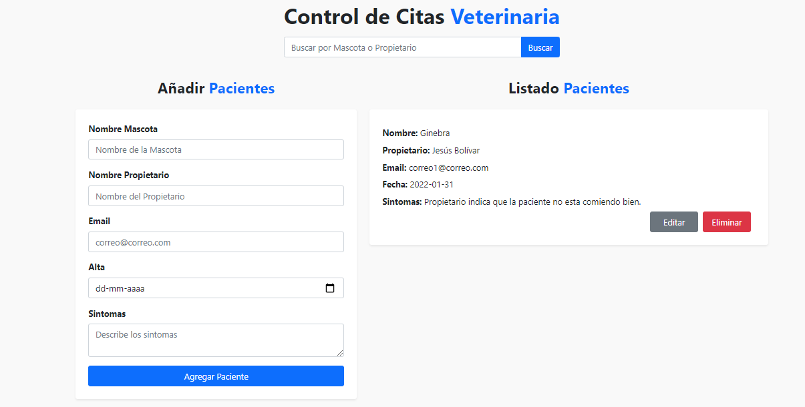
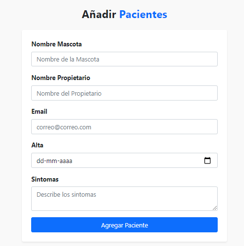
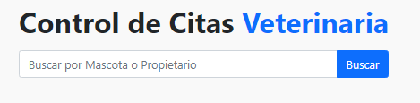

# Control de Citas React
App para llevar control de citas de pacientes de una veterinaria guardando los datos en el localStorage del navegador.

[Visualiza Aqui, Control de citas React JS](https://amazing-sammet-2ced73.netlify.app/)

  

  

